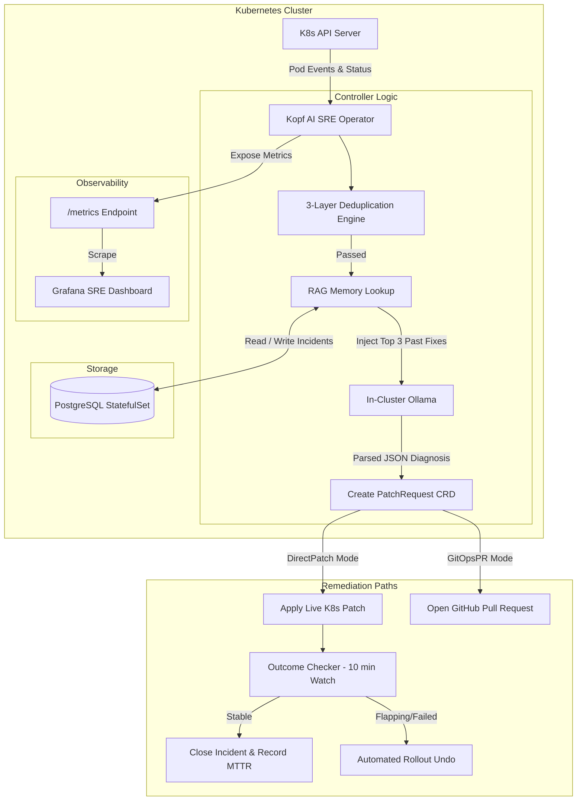

# 🚀 K8s AI SRE Agent — Advanced Architecture & Feature Expansion Document

This document outlines the architectural roadmap for evolving the **Kubernetes AI SRE Agent** into an enterprise-ready, production-grade SRE platform. It covers what will be added, how the infrastructure will change, and the technical impact each addition creates.

---

## 📌 Executive Summary

While standard autonomous agents stop at basic log analysis and manual patch creation, this expansion introduces **closed-loop remediation, historical RAG memory, full Prometheus observability, and GitOps compliance**.

```
┌─────────────────────────────────────────────────────────────────────────────────────────┐
│                                   CURRENT CAPABILITIES                                   │
│  Log Fetching ➔ Deduplication ➔ Ollama LLM Diagnosis ➔ PatchRequest CRD ➔ Human Approval│
└─────────────────────────────────────────────────────────┬───────────────────────────────┘
                                                          │
                                                          ▼
┌─────────────────────────────────────────────────────────────────────────────────────────┐
│                                  ADVANCED CAPABILITIES                                  │
│  ┌─────────────────────────┐  ┌────────────────────────┐  ┌──────────────────────────┐ │
│  │ Module 1:               │  │ Module 2:              │  │ Module 3:                │ │
│  │ Outcome Checker         │  │ RAG Incident Memory    │  │ Prometheus Metrics       │ │
│  │ & Automated Rollback    │  │ (PostgreSQL Vector)    │  │ Exporter & Dashboards    │ │
│  └─────────────────────────┘  └────────────────────────┘  └──────────────────────────┘ │
│  ┌───────────────────────────────────────────────────────────────────────────────────┐ │
│  │ Module 4: GitOps PR Engine (Pull Request Remediation via GitHub/ArgoCD)          │ │
│  └───────────────────────────────────────────────────────────────────────────────────┘ │
└─────────────────────────────────────────────────────────────────────────────────────────┘
```

---

## 🛠️ Module Breakdown

### 1️⃣ Module 1: Outcome Checker & Automated Rollback

#### What We Will Add
- **Component**: `controller/outcome_checker.py` (Kopf background timer activity running every 60 seconds).
- **Post-Fix Stability Monitoring**: After a `PatchRequest` transitions to `Applied`, the outcome checker tracks the target pod for a configurable **Observation Window** (e.g., 10 minutes).
- **Automated Rollback Engine**:
  - **Success Path**: If the pod remains in `1/1 Running` state with 0 crashes for 10 minutes, the agent marks `worked = True`, calculates final **MTTR (Mean Time to Resolution)**, updates PostgreSQL, and transitions the state machine to `Closed`.
  - **Failure / Flapping Path**: If the pod crashes again within the 10-minute window, the agent issues an immediate **Rollback** via `kubectl rollout undo deployment/<name>`, sets `worked = False`, records the patch failure, and reopens the investigation state with the new crash trace.

#### Infrastructure Changes
- **CRD Schema Update**: Add `observationWindowSeconds`, `rollbackTriggered`, and `previousRevision` to `PatchRequest` status.
- **RBAC Extension**: Grant `sre-executor-sa` permissions to view deployment rollout histories (`deployments/rollback`, `deployments/scale`).

#### Technical & Interview Impact
- **SRE Value**: Eliminates "fire-and-forget" patches. Solves the dangerous production trap where an automated fix temporarily suppresses an error only to cause a silent cascade 5 minutes later.
- **Interview Talking Point**: *"Our agent implements closed-loop verification. If a patch fails stability validation, it automatically rolls back to the previous known-good deployment revision within seconds, maintaining high availability."*

---

### 2️⃣ Module 2: RAG Incident Memory (PostgreSQL Few-Shot Engine)

#### What We Will Add
- **Component**: `db/db_client.py` & `controller/memory.py` (Async PostgreSQL client powered by `asyncpg` + `SQLAlchemy[asyncio]`).
- **RAG Pre-Inference Query**: Before invoking Ollama, the agent extracts the crash fingerprint and error state, performing a similarity search in PostgreSQL against historical `incidents` and `resolutions` tables.
- **Prompt Augmentation**: Top-3 relevant past incidents (with root causes, approved fixes, and SRE notes) are injected directly into the LLM prompt as **Few-Shot Context**.

#### Infrastructure Changes
- **Database Deployment**: Utilize `monitoring/postgres-0` (PostgreSQL 15 StatefulSet) configured with persistent volume storage (`pgdata-pvc`).
- **Schema Migration**: Add indexes on `(error_fingerprint, error_state)` and full-text search vectors on `cleaned_logs`.

#### Technical & Interview Impact
- **SRE Value**: Decreases LLM diagnosis latency and hallucination rates. As the cluster encounters incidents over time, the agent gets progressively smarter by leveraging past institutional knowledge.
- **Interview Talking Point**: *"Instead of relying purely on zero-shot LLM reasoning, we built an in-cluster RAG engine over PostgreSQL. The agent retrieves past human-approved resolutions, reducing inference hallucinations and boosting confidence."*

---

### 3️⃣ Module 3: Prometheus Metrics Exporter & Operational Observability

#### What We Will Add
- **Component**: `controller/metrics.py` (Prometheus Metrics Exporter integrated into the controller).
- **Exposed Port**: `/metrics` HTTP endpoint on port `8080` scraped by Prometheus every 15s.
- **Key Metrics Tracked**:
  ```prometheus
  # Total incidents detected by state and error classification
  sre_agent_incidents_total{namespace="production", deployment="auth-service", error_state="CrashLoopBackOff", state="Investigating"} 12

  # Ollama LLM inference latency histogram
  sre_agent_ollama_inference_duration_seconds_bucket{le="30.0"} 4

  # Deduplication layer efficiency (Layer 1 Dampening vs Layer 2 Fingerprint vs Layer 3 API)
  sre_agent_dedup_hits_total{layer="dampening"} 45
  sre_agent_dedup_hits_total{layer="fingerprint_cache"} 18

  # Mean Time to Resolution (MTTR) histogram
  sre_agent_mttr_seconds_bucket{le="300.0"} 8

  # Remediation outcomes (Applied vs Rolled Back vs Rejected)
  sre_agent_remediations_total{action="patch", outcome="success"} 9
  sre_agent_remediations_total{action="rollback", outcome="triggered"} 1
  ```

#### Infrastructure Changes
- **ServiceMonitor Manifest**: Add `ServiceMonitor` for Prometheus Operator / VictoriaMetrics scraping.
- **Grafana Dashboard**: Importable JSON Grafana dashboard visualizing MTTR, LLM latency distribution, active incidents map, and dedup savings ratio.

#### Technical & Interview Impact
- **SRE Value**: Provides full telemetry into the AI operator itself. Allows SRE leads to measure exact ROI (e.g., *"Saved 85% of LLM calls via 3-layer dedup"* and *"Reduced MTTR from 45 min to 4.2 min"*).
- **Interview Talking Point**: *"We treats our AI agent as a core production service, exposing Prometheus metrics for MTTR, LLM inference latency, and deduplication efficiency with a custom Grafana dashboard."*

---

### 4️⃣ Module 4: GitOps PR Engine (Pull Request Remediation)

#### What We Will Add
- **Component**: `controller/gitops.py` (Async GitHub / GitLab API integration).
- **Dual Remediation Modes**:
  - **Direct Patch Mode** (Dev/Staging): Live `kubectl patch` applied directly to cluster state.
  - **GitOps PR Mode** (Production Enterprise): Rather than modifying live cluster state, the agent clones the infrastructure repository, updates the Helm `values.yaml` or Kustomize manifest, creates a feature branch, and opens a **GitHub Pull Request**.

#### Infrastructure Changes
- **Secret Integration**: Mount `github-app-token` or `gitops-ssh-key` into `monitoring/sre-controller`.
- **CRD Spec Addition**: Add `spec.remediationMode: DirectPatch | GitOpsPR` and `status.pullRequestUrl`.

#### Technical & Interview Impact
- **SRE Value**: Complies with strict GitOps standards (ArgoCD / FluxCD). Ensures cluster state never drifts from source control.
- **Interview Talking Point**: *"For enterprise environments where direct cluster patching is forbidden, our agent supports GitOps mode—automatically creating Pull Requests against Helm repositories so fixes undergo peer review and ArgoCD sync."*

---

## 🔄 Complete End-to-End System Architecture



---

## 📊 Summary of Architectural & Operational Impact

| Feature | Infrastructure Added | SLA & Reliability Impact | Interview Wow-Factor |
|---|---|---|---|
| **Module 1: Outcome Checker** | Kopf background timer, deployment rollback RBAC | Prevents silent post-patch failures; auto-reverts bad fixes | Demonstrates production safety & closed-loop engineering |
| **Module 2: RAG Incident Memory** | PostgreSQL 15 StatefulSet, `asyncpg` vector search | Reduces LLM hallucination; speeds up recurring diagnoses | Shows advanced AI engineering beyond simple prompting |
| **Module 3: Prometheus Observability** | `/metrics` endpoint, Grafana JSON dashboard | Quantifies SRE ROI, MTTR reduction, and LLM cost savings | Proves deep alignment with standard DevOps/SRE tooling |
| **Module 4: GitOps PR Engine** | GitHub API integration, `gitops-secret` mount | Enforces Infrastructure-as-Code & zero cluster drift | Appeals directly to enterprise managers using ArgoCD/Flux |

---

## 🎯 Recommended Execution Plan

1. **Step 1**: Build **Module 1 (Outcome Checker & Automated Rollback)** to establish closed-loop reliability.
2. **Step 2**: Implement **Module 3 (Prometheus Metrics Exporter)** to make system telemetry visible.
3. **Step 3**: Implement **Module 2 (RAG Incident Memory)** over PostgreSQL.
4. **Step 4**: Add **Module 4 (GitOps PR Engine)** for enterprise policy compliance.
