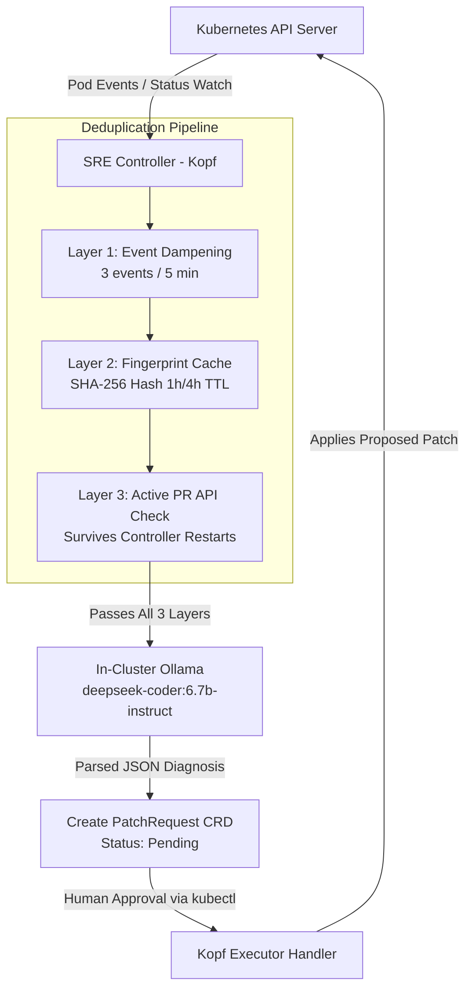

# 📘 Kubernetes AI SRE Agent — Execution & Engineering Document

This document presents a step-by-step account of the design, setup, implementation, error troubleshooting, and live verification of the **Air-Gapped Kubernetes AI SRE Agent**.

---

## 📑 Table of Contents

1. [Project Architectural Overview](#1-project-architectural-overview)
2. [Phase 1: Cluster & AI Infrastructure Provisioning](#phase-1-cluster--ai-infrastructure-provisioning)
3. [Phase 2: Controller & Domain Logic Implementation](#phase-2-controller--domain-logic-implementation)
4. [Phase 3: Testing & Verification](#phase-3-testing--verification)
5. [Phase 4: Real-World E2E Failure Simulation & Healing](#phase-4-real-world-e2e-failure-simulation--healing)
6. [Comprehensive Troubleshooting & Resolution Matrix](#comprehensive-troubleshooting--resolution-matrix)
7. [Security & Isolation Profile](#security--isolation-profile)

---

## 1. Project Architectural Overview

The AI SRE Agent is a Kopf-based Kubernetes operator designed to run **100% air-gapped** inside a Kubernetes cluster. It continuously observes workloads, diagnoses container failures using an in-cluster LLM (`deepseek-coder:6.7b-instruct`), deduplicates crash events, and manages remediation through human-approved Custom Resource Definitions (`PatchRequest`).



---

## Phase 1: Cluster & AI Infrastructure Provisioning

### 1. Multi-Node Kind Cluster Provisioning

- **Goal**: Create a local, multi-node Kubernetes cluster isolating workload execution from heavy AI inference tasks.
- **Implementation**: Created `kind-config.yaml` defining 3 distinct nodes:
  - `sre-agent-cluster-control-plane`: Control Plane node.
  - `sre-agent-cluster-worker`: General application workloads (`production` namespace).
  - `sre-agent-cluster-worker2`: Dedicated AI inference node with a taint `node-role.kubernetes.io/ai-infra:NoSchedule`.
- **Command Executed**:
  ```bash
  kind create cluster --config kind-config.yaml --name sre-agent-cluster
  ```

### 2. Air-Gapped Ollama Deployment

- **Goal**: Deploy Ollama with `deepseek-coder:6.7b-instruct` locked inside the `ai-infra` namespace without internet egress.
- **Node Affinity & Tolerations**:
  ```yaml
  tolerations:
    - key: "node-role.kubernetes.io/ai-infra"
      operator: "Exists"
      effect: "NoSchedule"
  nodeSelector:
    node-role.kubernetes.io/ai-infra: "true"
  ```
- **NetworkPolicy**: Blocked all outbound internet egress from `ai-infra`, allowing incoming connections only from the `monitoring` namespace (where the controller lives).

---

## Phase 2: Controller & Domain Logic Implementation

### 1. State Machine (`controller/states.py` & `controller/incident.py`)

To govern incident lifecycles safely, we implemented the **State Pattern**:

```
Open ───► Investigating ───► Resolved ───► Closed (Terminal)
               ▲                │
               └────────────────┘ (Patch failed / reopen)
```

- **Rules Enforced**:
  - `Open → Investigating`: Triggered when Ollama accepts diagnosis.
  - `Investigating → Resolved`: Requires non-empty patch and explicit approver ID.
  - `Resolved → Closed`: Enforces **Transactional RCA Validation** (`worked=True` & RCA summary ≥ 30 characters).
  - `Closed`: Terminal state. No further transitions allowed.

### 2. 3-Layer Deduplication Pipeline (`controller/dedup.py`)

To prevent Ollama CPU exhaustion and alert fatigue:
1. **Layer 1 (Event Dampening)**: Requires a pod to crash ≥ 3 times in 5 minutes before invoking LLM inference. *OOMKilled events bypass dampening and trigger immediately.*
2. **Layer 2 (Log Fingerprint Cache)**: Hashes cleaned log excerpts + error state into a 16-char hex fingerprint (SHA-256). Identical crashes within 1 hour bypass Ollama and increment `seenCount` on the open `PatchRequest`.
3. **Layer 3 (Active K8s API Check)**: Queries the Kubernetes API Server for active `Pending` or `Approved` `PatchRequest` CRDs. This layer ensures deduplication survives controller pod restarts.

### 3. Log Preprocessing (`controller/log_preprocessor.py`)

- Strips timestamps (`2026-07-24T...`), ANSI color codes, and noise (health checks, HTTP GET 200 logs).
- Extracts stack traces, FATAL, OOMKilled, and exit code lines.
- Enforces a 4,000-character budget (~1,000 tokens) to guarantee prompt size predictability.

### 4. Robust Ollama Client (`controller/ollama_client.py`)

- **Concurrency Gate**: `asyncio.Semaphore(3)` caps simultaneous LLM inferences to preserve host CPU stability.
- **5-Layer JSON Parser**: Standardizes LLM output into a strict schema. If the model outputs raw text or markdown fences, 5 consecutive regex/repair strategies run before returning a safe fallback object—ensuring the pipeline never crashes.

### 5. Kopf Operator Main Entry Point (`controller/main.py`)

- `@kopf.on.startup()`: Performs a **Startup Catch-Up Scan** across namespaces to detect failing pods missed during controller downtime.
- `@kopf.on.field("pods", field="status.containerStatuses")`: Watch handler triggering log preprocessing, 3-layer dedup, Ollama diagnosis, and `PatchRequest` CRD creation.
- `@kopf.on.field("patchrequests", field="status.approvalState")`: Executor handler triggering deployment patching when an SRE updates a `PatchRequest` status to `Approved`.

---

## Phase 3: Testing & Verification

We established a pytest unit suite testing the state machine and log preprocessor without requiring a live K8s cluster or Ollama instance.

### Test Execution Command
```bash
.venv/bin/python -m pytest tests/ -v
```

### Output Summary
```
======================= test session starts =======================
platform linux -- Python 3.13.5, pytest-9.1.1
collected 32 items

tests/test_preprocessor.py ............... PASSED [ 43%]
tests/test_states.py ..................... PASSED [100%]

======================= 32 passed in 0.07s ========================
```

---

## Phase 4: Real-World E2E Failure Simulation & Healing

We performed a live end-to-end simulation by introducing an image configuration error into the `production` namespace.

### Step 1: Workload Failure Injection
Deployed `frontend-web` with a non-existent image tag `nginx:invalid-tag-12345`.

### Step 2: Automated Detection & LLM Diagnosis
The controller detected `ImagePullBackOff`, preprocessed the logs, and queried Ollama.

**Controller Log Output**:
```text
[INC-2026-0724-85D7] New incident: production/frontend-web in state ImagePullBackOff
[INC-2026-0724-85D7] Queuing Ollama request (model=deepseek-coder:6.7b-instruct)
[INC-2026-0724-85D7] Ollama responded in 196.7s
[INC-2026-0724-85D7] Open -> Investigating
[INC-2026-0724-85D7] PatchRequest CRD created: frontend-web-pr-2026-0724-85d7
[INC-2026-0724-85D7] IncidentRecord CRD created
🔴 [LOW] ImagePullBackOff — production/frontend-web
   Root Cause: ImagePullBackOff error due to non-existent image tag in the pod specification.
   Suggested Fix: Ensure that the correct image and tag are specified in the pod specification.
```

### Step 3: Human-in-the-Loop Approval
The SRE inspected the generated `PatchRequest` and approved the remediation via `kubectl`:

```bash
kubectl patch pr frontend-web-pr-2026-0724-85d7 -n production \
  --subresource=status --type=merge \
  -p '{"status":{"approvalState":"Approved","approvedBy":"rahul@company.com"}}'
```

### Step 4: Automated Patch Application & Verification
The Kopf executor detected the `Approved` state, patched `deployment/frontend-web` with `nginx:alpine`, and verified the rollout:

```bash
$ kubectl get pods -n production -l app=frontend-web
NAME                            READY   STATUS    RESTARTS   AGE
frontend-web-7dd4f96c68-m8rq2   1/1     Running   0          105s
```

---

## Comprehensive Troubleshooting & Resolution Matrix

During development, we encountered and resolved 8 technical challenges:

| # | Component | Symptom / Error Log | Root Cause | Engineering Resolution |
|---|---|---|---|---|
| 1 | Ollama StatefulSet | Container killed unexpectedly (`exit code 137`) | Memory limit of 4Gi was insufficient for CPU inference on `deepseek-coder:6.7b-instruct` | Increased memory limits to `7Gi` and memory requests to `3Gi` in `k8s/ollama-statefulset.yaml`. |
| 2 | LLM HTTP Client | `httpx.TimeoutException` during cold-start inference | Default HTTP client timeout (30s) expired while model loaded into host RAM | Raised `OLLAMA_TIMEOUT` to 300s in client and controller deployment env vars. |
| 3 | State Machine | `DeprecationWarning: datetime.utcnow() is deprecated` | Python 3.13 deprecation of naive UTC datetimes | Updated all timestamp calls across `states.py`, `incident.py`, `dedup.py`, and `main.py` to `datetime.now(timezone.utc).replace(tzinfo=None)`. |
| 4 | Container Build | `ERROR: No matching distribution found for kubernetes-asyncio==32.0.1` | PyPI package uses an underscore (`kubernetes_asyncio`), and version 32.0.1 was not published | Corrected package name to `kubernetes_asyncio==36.1.0` in `requirements.txt`. |
| 5 | Kopf Runtime | `ModuleNotFoundError: No module named 'controller'` | Kopf runs `main.py` as a standalone script; `/app` was missing from `sys.path` | Added `ENV PYTHONPATH=/app` to `Dockerfile`. |
| 6 | K8s Config Loader | `TypeError: object NoneType can't be used in 'await' expression` on `load_incluster_config()` | `kubernetes_asyncio ≥ 24` changed `load_incluster_config()` from an async coroutine to a synchronous function | Encapsulated config loading in a synchronous helper `_ensure_k8s_configured()`. |
| 7 | Controller RBAC | `APIForbiddenError: User sre-observer-sa cannot patch resource deployments` | `sre-observer-role` only had `[get, list, watch]` permissions on `apps/deployments` | Added `patch` and `update` verbs for `deployments` and `statefulsets` to `sre-observer-role` in `k8s/rbac.yaml`. |
| 8 | CRD Status Patch | `HTTP 400 Bad Request: error decoding patch: cannot unmarshal object into Go value of type []handlers.jsonPatchOp` | Calling `patch_namespaced_custom_object` for status updates bypassed the CRD status subresource endpoint | Updated calls to `patch_namespaced_custom_object_status(...)` and used `kubectl patch --subresource=status`. |

---

## Security & Isolation Profile

- **Air-Gapped Egress Guarantee**: NetworkPolicy blocks all outbound network traffic from `ai-infra`.
- **RBAC Least Privilege**:
  - `sre-observer-sa`: Authorized to read pod logs/events and manage `PatchRequest`/`IncidentRecord` CRDs.
  - `sre-executor-sa`: Scope-limited strictly to patching Deployments, StatefulSets, and ConfigMaps—with zero access to Secrets or RBAC resources.
- **Non-Destructive Defaults**: Automatic cluster-altering patches are strictly prohibited; every action requires explicit human approval via the `PatchRequest` CRD lifecycle.
